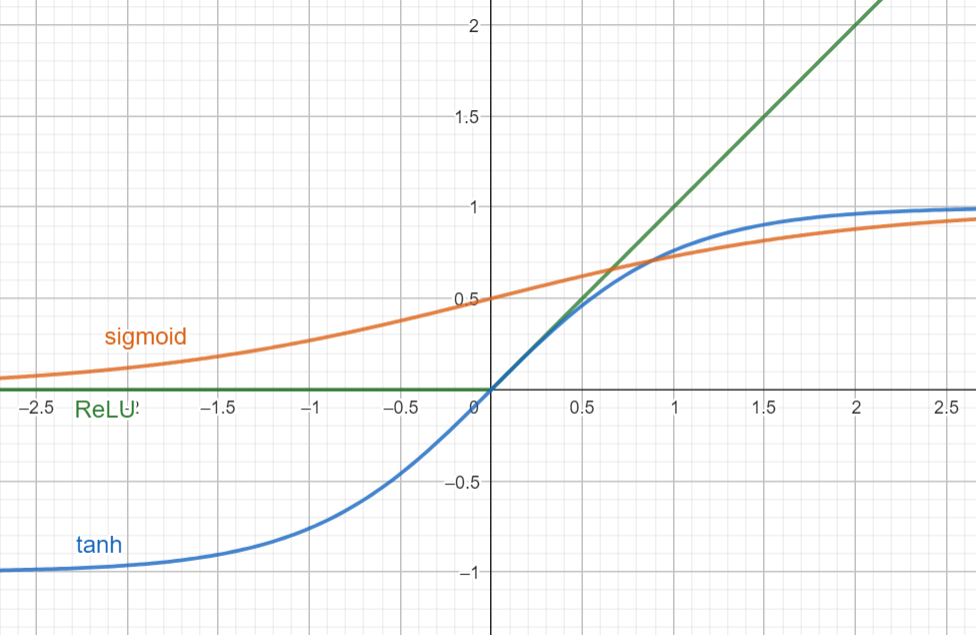
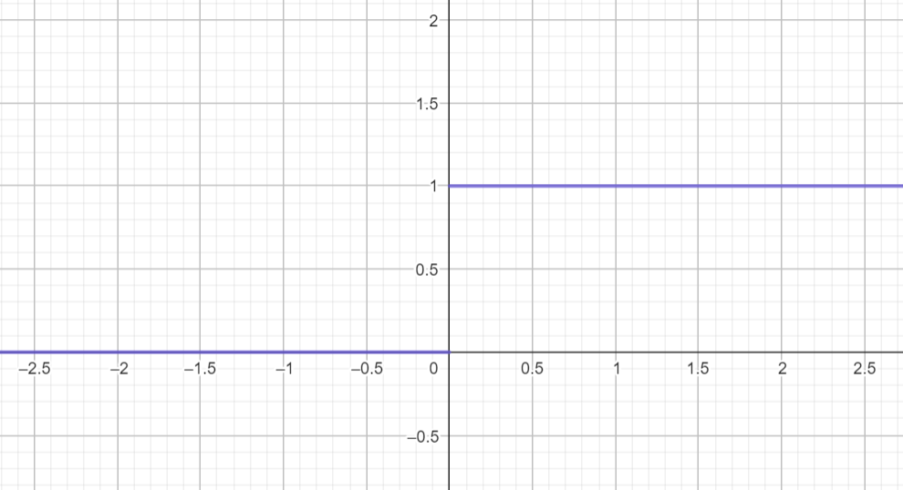
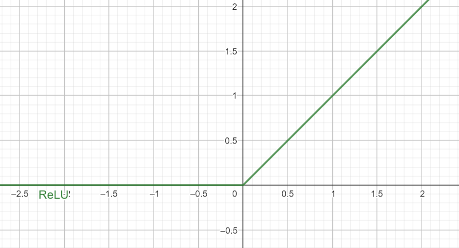
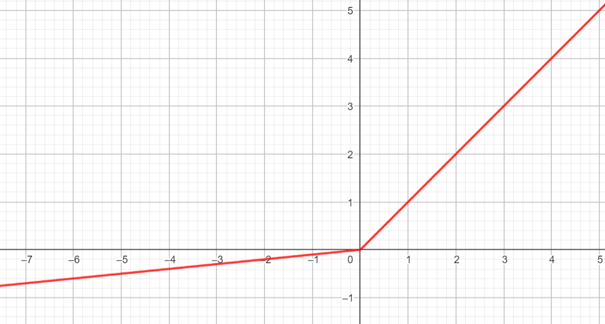
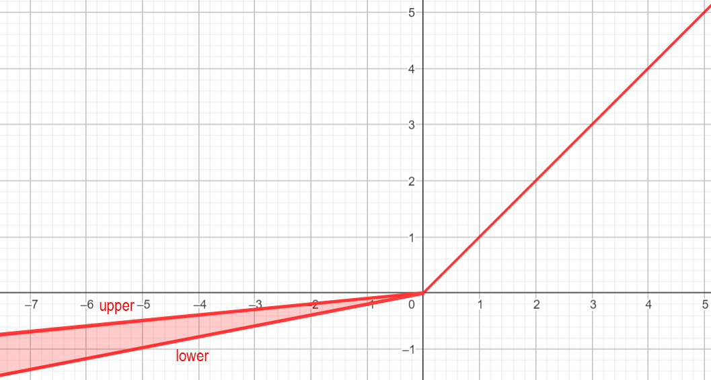
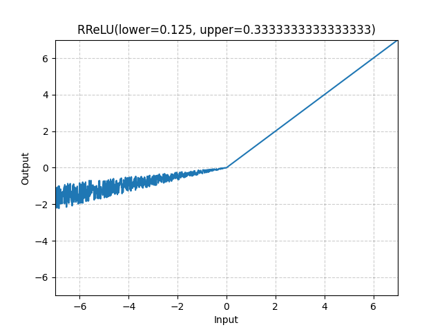
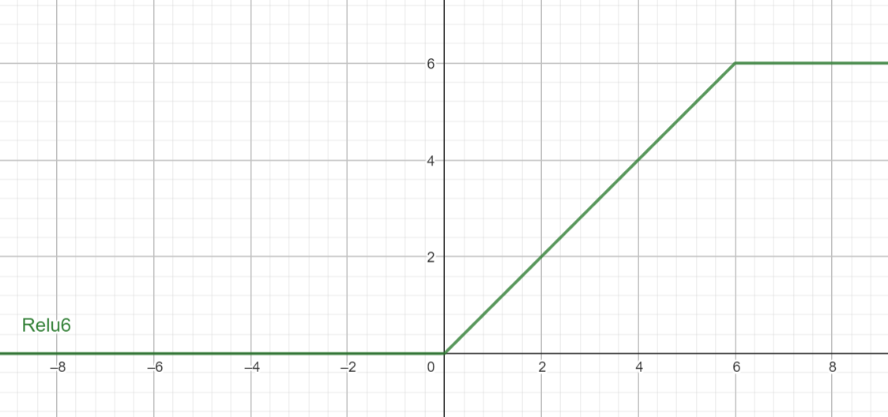
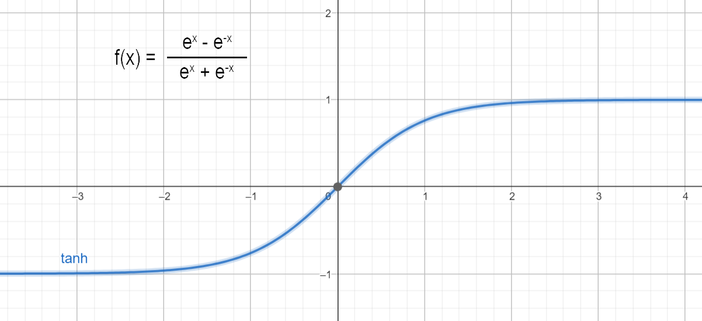
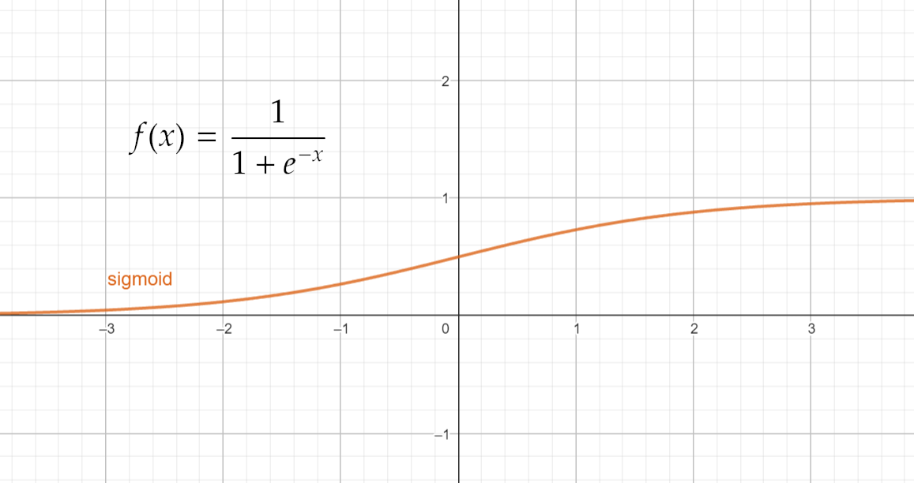

- Activation Functions are used to introduce non-linearity in the network. 
- A neural network will almost always have the same activation function in all hidden layers. This activation function should be differentiable so that the parameters of the network are learned in backpropagation. 
- `ReLU` is the most commonly used activation function for hidden layers. 
- While selecting an activation function, you must consider the problems it might face: `vanishing` and `exploding` gradients. 
- Regarding the output layer, we must always consider the expected value range of the predictions. If it can be any numeric value (as in case of the regression problem) you can use the linear activation function or `ReLU`.

---

### Threshold [🔗](https://pytorch.org/docs/stable/generated/torch.nn.Threshold.html#torch.nn.Threshold)
> AKA: Binary Step Function



```sh
f(x) = {
    1:  if x >= threshold
    0:  if x < threshold
}
```

> PyTorch implementation
```
f(x) = {
        x:  if x > threshold
    value:  otherwise
}
```

- This type of activation function is rarely used in hidden layers because it is `not differentiable`, which makes it challenging to use with gradient-based optimization algorithms like gradient descent. Instead, more continuous and differentiable activation functions like `sigmoid`, `tanh`, or `ReLU` are commonly employed.
- However, threshold functions can be used in output layers for binary classification problems, where the network needs to make a binary decision based on the input data.

---

### ReLU [🔗](https://pytorch.org/docs/stable/generated/torch.nn.ReLU.html#torch.nn.ReLU)
> Rectified Linear Unit



```sh
f(x) = max(0, x)
```

- Most widely used activation functions in neural networks.
- Known for its simplicity and effectiveness.
- Introduces non-linearity to the model, allowing it to learn complex relationships in the data.
- Computationally efficient because it involves simple operations
- Can lead to sparse activations because it sets negative values to 0. Sparse activations can be advantageous in some cases.

> Disadvantages

- Neurons with `ReLU` activations can sometimes become `"dead"` during training, meaning they always output 0 and don't contribute to learning. This can happen when a large gradient flows through a `ReLU` neuron, causing it to update in a way that always produces 0. This lead to the development of variants like `Exponential Linear Unit (ELU)`
- `ReLU` has an unbounded output range for positive values, which can be problematic in some cases. This issue led to the development of variants like `Leaky ReLU`, `Parametric ReLU (PReLU)`

> Common problems in using ReLU

- `Vanishing Gradients`: One common issue with ReLU is that during training, gradients can become very small, effectively "vanishing." This often happens when the network has a deep architecture. If you notice that your network is struggling to learn, and gradients are becoming extremely small, it could be a sign of a dying ReLU problem.
- `Neurons Stuck at Zero`: Some ReLU neurons may become "dead" during training, meaning they always output zero. You can detect this by monitoring the activation values of neurons during training. If you see that many neurons consistently output zero, it's a sign of the dying ReLU problem.
- `Unstable Training`: If your model's training is unstable, with erratic changes in loss or accuracy, it could be related to the ReLU activation function. ReLU can sometimes cause abrupt changes in neuron activations, leading to instability.
- `Poor Convergence`: If your network is converging slowly or not converging at all to a satisfactory solution, it might be due to ReLU-related issues. Poor convergence can result from neurons with zero activations not contributing to learning.

---

### Leaky ReLU [🔗](https://pytorch.org/docs/stable/generated/torch.nn.LeakyReLU.html#torch.nn.LeakyReLU)
> Leaky Rectified Linear Unit



- A `ReLU` variant
- Addresses one of its limitation the `dying ReLU` problem
- Leaky ReLU introduces a small, non-zero gradient for negative inputs, preventing neurons from becoming completely inactive.

```sh
f(x) = {
                     x  : if x > 0
    negative_slope * x  : if x <= 0
}
```

> Pytorch version
```sh
f(x) = max(0, x) + negative_slope * min(0, x)
```

- `Non-Linearity`: Like `ReLU`, `Leaky ReLU` introduces non-linearity to the network, which is crucial for learning complex relationships in the data.
- `Prevents Dying Neurons`: By allowing a non-zero gradient for negative inputs, `Leaky ReLU` helps prevent the `dying ReLU` problem, where neurons become inactive during training.
- `Computational Efficiency`: `Leaky ReLU` is computationally efficient to compute because it involves simple operations (multiplication and comparison).
- `Variants`: There are variations of `Leaky ReLU`, such as `Parametric ReLU (PReLU)`, where negative_slope is a learnable parameter, allowing the network to adaptively determine the slope for each neuron.

---

### PReLU [🔗](https://pytorch.org/docs/stable/generated/torch.nn.PReLU.html#torch.nn.PReLU)
> Parametric Rectified Linear Unit


- A `ReLU` variant
- `PReLU` introduces learnable parameters to control the slope of the activation function, making it adaptable during training.

```sh
f(x) = {
    x if x > 0
    alpha * x if x <= 0
}
```

- alphas is the learnable parameter

> Advantages

- `Adaptive Slope`: `PReLU` allows each neuron to have its own learnable slope parameter `alpha`. This adaptability helps improve model performance and mitigates issues like the `dying ReLU` problem.
- `Non-Linearity`: Like `ReLU` and `Leaky ReLU`, `PReLU` introduces non-linearity to the network, which is crucial for learning complex relationships in the data.
- `Prevents Dying Neurons`: The inclusion of a learnable parameter alpha prevents neurons from becoming completely inactive during training.
- `Variability`: `PReLU` introduces variability in the slope of the activation function, which can be beneficial in modeling complex data distributions.

---

### RReLU [🔗](https://pytorch.org/docs/stable/generated/torch.nn.RReLU.html#torch.nn.RReLU)
> Randomized Leaky Rectified Linear Unit

- A `ReLU` variant




- `RReLU` introduces randomization to the slope of the activation function during training.

```sh
f(x) = {
    x if x > 0
    alpha * x if x <= 0
}
```

- alpha is randomly picked within predifined range [lower, upper]

> Advantages

- `Randomization`: `RReLU` introduces randomness into the activation function, which can act as a form of `regularization`. This can help prevent `overfitting` and improve the `generalization` of the model.
- `Leaky Behavior`: Similar to `Leaky ReLU`, `RReLU` prevents neurons from becoming completely inactive during training, mitigating the `dying ReLU` problem.
- `Adaptability`: `RReLU` adapts the slope of the activation function for each neuron independently during training, potentially making it more flexible in capturing complex patterns in the data.
- `Controlled Randomness`: The randomization in `RReLU` is controlled by specifying the [lower, upper] range, allowing you to adjust the level of randomization.

---

### ReLU6 [🔗](https://pytorch.org/docs/stable/generated/torch.nn.ReLU6.html#torch.nn.ReLU6)
> Leaky Rectified Linear Unit 6



- A `ReLU` variant
- `ReLU6` introduces an upper threshold value of 6 to the standard ReLU, which helps bound the output within a limited range.
- Clamps value between 0 and 6

```sh
f(x) = min(max(0, x), 6)
```

- `Bounded Activation`: `ReLU6` bounds the positive side of the activation output to a maximum value of 6, preventing activations from growing too large during training. This can help with model stability.
- `Non-linearity`: Like `ReLU`, `ReLU6` introduces non-linearity to the network, which is crucial for learning complex relationships in the data.
- `Efficiency`: `ReLU6` is computationally efficient to compute because it involves simple comparisons and thresholding.
- `Saturating Behavior`: `ReLU6` saturates for inputs greater than or equal to 6, which can help stabilize training.
- `Suitable for Mobile Devices`: `ReLU6` is often used in models designed for mobile and embedded devices due to its efficiency and bounded output range.

---

### Tanh [🔗](https://pytorch.org/docs/stable/generated/torch.nn.Tanh.html#torch.nn.Tanh)
> Hyperbolic Tangent



- `exp(x)` is e<sup>x</sup>, where e is eulers number, e approx `2.71828`
- `tanh` output range is `-1` to `1`

```sh
f(x) = ( exp(x) − exp(−x) ) / ( exp(x) + exp(-x) )
```

- `Range`: The output of `tanh` is bounded between `-1` and `1`. This makes it useful for problems where you want to normalize data or constrain the output within a specific range.
- As `x` becomes `very negative`, the `tanh` function approaches `-1`, and as `x` becomes `very positive`, it approaches `1`.
- `Symmetry`: The tanh function is symmetric around the origin `(0, 0)`. In other words, `tanh(-x) = -tanh(x)`.
- `S-shaped curve`: The tanh function has an S-shaped curve similar to the `sigmoid` function, but it ranges from `-1 to 1`, whereas the `sigmoid` function ranges from `0 to 1`.
- `Zero-Centered`: Unlike the `sigmoid` function, the `tanh` function is `zero-centered`, which means it has an average output of zero when its input is centered around zero. This property can help mitigate the vanishing gradient problem in some cases and make optimization easier.
- `Tanh` is often used in `recurrent neural networks (RNNs)` and in some `hidden layers` of `feedforward neural networks`, particularly when the input data or model requires `zero-centered` activations.
- However, for many deep learning applications, the `ReLU` and its variants have become more popular due to their simplicity and effectiveness in mitigating the `vanishing gradient` problem.

> Disadvantages
- `Saturation`: Like the `sigmoid`, the `tanh` function saturates when its input values are extremely positive or negative, causing the gradient to become very small. This can hinder the training process, particularly for deep networks.
- `Vanishing Gradient`: While the `tanh` function is `zero-centered`, it still suffers from the vanishing gradient problem, especially for very large or very small input values. In deep networks, this can slow down training.
- `Limited Output Range`: The output of the `tanh` function is limited to the range `[-1, 1]`, which can be a disadvantage in certain cases. For instance, in some applications where the model needs to produce outputs outside of this range, other activation functions like `ReLU` may be more appropriate.

---

### Hard tanh [🔗](https://pytorch.org/docs/stable/generated/torch.nn.Hardtanh.html#torch.nn.Hardtanh)

---

### Tanh shrink [🔗](https://pytorch.org/docs/stable/generated/torch.nn.Tanhshrink.html#torch.nn.Tanhshrink)

---

### Hard shrink [🔗](https://pytorch.org/docs/stable/generated/torch.nn.Hardshrink.html#torch.nn.Hardshrink)

---

### Soft shrink [🔗](https://pytorch.org/docs/stable/generated/torch.nn.Softshrink.html#torch.nn.Softshrink)

---

### Sigmoid [🔗](https://pytorch.org/docs/stable/generated/torch.nn.Sigmoid.html#torch.nn.Sigmoid)



- output ranges between `0` and `1`
- As `x` becomes `very negative`, the `sigmoid` function approaches `0`, and as `x` becomes `very positive`, it approaches `1`.

```sh
f(x) = 1 / ( 1 + e^(-x) )
```

- `Sigmoid` squashe x into the range between `0` and `1`.
- `Sigmoid` is often used in the hidden layers to introduce non-linearity to the model.
- `Sigmoid` function was more popular in the past, but has been largely replaced by other activation functions like `ReLU`

> Disadvantages

- `Vanishing gradient` problem
- `Not Zero-Centered`: means the output is always positive, This can lead to issues in backpropagation, and can result in slower convergence during training.
- `Prone to Saturation`: The `Sigmoid` function is prone to saturation, meaning that for very large positive or negative inputs, the function's output becomes close to 1 or 0, respectively. In this regime, the gradient is very close to zero, leading to slow learning.
- `Biased Outputs`: `Sigmoid` outputs are biased towards extreme values (0 or 1) for inputs that are not near 0, making it less ideal for tasks where the model should be more uncertain about the prediction.

---

### Hard Sigmoid [🔗](https://pytorch.org/docs/stable/generated/torch.nn.Hardsigmoid.html#torch.nn.Hardsigmoid)

---

### Log Sigmoid [🔗](https://pytorch.org/docs/stable/generated/torch.nn.LogSigmoid.html#torch.nn.LogSigmoid)

---

### Softsign [🔗](https://pytorch.org/docs/stable/generated/torch.nn.Softsign.html#torch.nn.Softsign)

---

### Softplus [🔗](https://pytorch.org/docs/stable/generated/torch.nn.Softplus.html#torch.nn.Softplus)

---

### Softmin [🔗](https://pytorch.org/docs/stable/generated/torch.nn.Softmin.html#torch.nn.Softmin)

---

### Softmax [🔗](https://pytorch.org/docs/stable/generated/torch.nn.Softmax.html#torch.nn.Softmax)

---

### Log Softmax [🔗](https://pytorch.org/docs/stable/generated/torch.nn.LogSoftmax.html#torch.nn.LogSoftmax)

---

### Elu [🔗](https://pytorch.org/docs/stable/generated/torch.nn.ELU.html#torch.nn.ELU)

---

### Selu [🔗](https://pytorch.org/docs/stable/generated/torch.nn.SELU.html#torch.nn.SELU)

---

### Celu [🔗](https://pytorch.org/docs/stable/generated/torch.nn.CELU.html#torch.nn.CELU)

---

### Glu [🔗](https://pytorch.org/docs/stable/generated/torch.nn.GLU.html#torch.nn.GLU)

---

### Gelu [🔗](https://pytorch.org/docs/stable/generated/torch.nn.GELU.html#torch.nn.GELU)

---

### Silu [🔗](https://pytorch.org/docs/stable/generated/torch.nn.SiLU.html#torch.nn.SiLU)

---

### Hard swish [🔗](https://pytorch.org/docs/stable/generated/torch.nn.Hardswish.html#torch.nn.Hardswish)

---

### Mish [🔗](https://pytorch.org/docs/stable/generated/torch.nn.Mish.html#torch.nn.Mish)

---


## Choosing the right Activation Function
1. Start with `ReLU`, move to others if not giving optimum results
1. Try variants of `ReLU` like `Leaky ReLU`, `PReLU`, `RReLU`
1. `ReLU` activation function should only be used in the hidden layers.
1. `Sigmoid` / `Logistic` and `Tanh` functions should not be used in hidden layers as they make the model more susceptible to problems during training (due to `vanishing gradients`).
1. `Swish` function is used in neural networks having a depth greater than 40 layers.

> For different types of training

1. `Regression` - `Linear`
1. `Binary Classification` - `Sigmoid` / `Logistic`
1. `Multiclass Classification` - `Softmax`
1. `Multilabel Classification` - `Sigmoid`

> For different types of networks

1. `Convolutional Neural Network (CNN)` - `ReLU`
1. `Recurrent Neural Network (RNN)` - `Tanh` and/or `Sigmoid`

